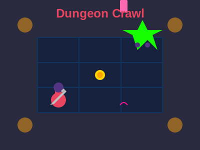

# Dungeon Crawl



## Description

Dungeon Crawl is an exciting text-based adventure game implemented in Python. Players navigate through a treacherous dungeon, battling monsters, collecting gold, and making strategic decisions. This project showcases the use of functions, randomization, and complex game logic in Python.

## Features

- Multiple interconnected rooms to explore
- Turn-based combat system
- Gold collection and inventory management
- Shop system for purchasing upgrades
- Unique monsters with varying difficulties
- Special items and power-ups

## How to Play

1. Run the script:
   ```
   python dungeonCrawl.py
   ```

2. Choose one of the following options from the main menu:
   - `p` to play the game
   - `i` to read the instructions
   - `q` to quit

3. If playing:
   - Navigate through rooms using directional commands (n, s, e, w)
   - Engage in combat with monsters
   - Collect gold and purchase upgrades in the magical shop
   - Try to reach the final room and defeat the boss

## Game Elements

- **Rooms**: Each room may contain gold, monsters, or special events
- **Combat**: Turn-based system where you can choose to attack or flee
- **Shop**: Spend gold on health potions or damage upgrades
- **Monsters**: Various types with different health and damage stats
- **Special Items**: The "Eye of Iris" grants increased accuracy

## Example Gameplay

```
Welcome to Dungeon Crawl...You life is in your hands! YEEEEEET

By: Abhay Prasanna Rao

MAIN MENU: [p]lay, [i]nstructions, or [q]uit?: p

Your courage and need for the gold has lead you here. What will be your fate in the rooms beyond?
Hi There, I am the ghost speaking with you. You have come to me, i will reward you with gold! Enjoy and come again, I am very lonely
The room has 15 gold pieces in it...
After taking the gold, you currently have 15 gold pieces in your posession...

Where do you wish to travel? 
[n] [s] [e] [w]?: e
--------------------------------------------------------------------------------------------------------------------------------------------------
You have engaged in combat
You have encountered a crazy Iris
COMBAT: (a)ttack, (f)lee: a
You slash the Iris with your sword and deal 1 damage
monster health = 2

The Iris bit you for 2 damage
player current health = 8/10

...
```

## Author

Abhay Prasanna Rao

## Technologies Used

- Python 3
- Random module for game randomization
- Sys module for system-specific parameters and functions

## Future Improvements

- Add a graphical user interface (GUI)
- Implement a save/load game feature
- Add more rooms, monsters, and items
- Create a difficulty setting system
- Implement a storyline with multiple endings
